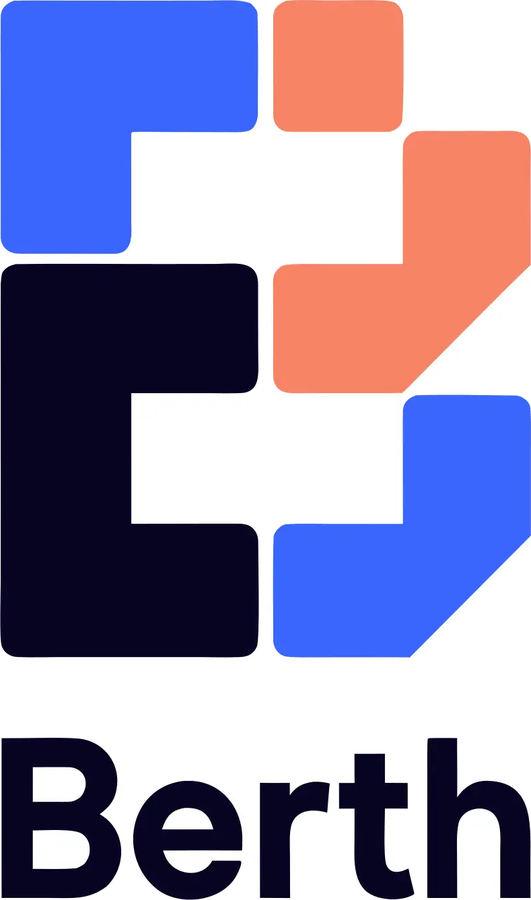
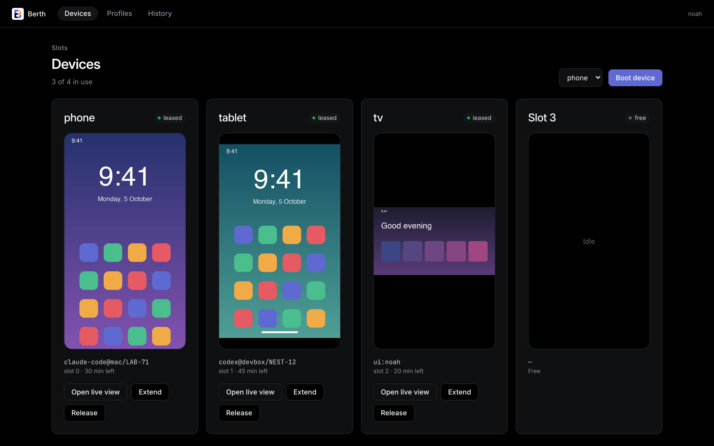
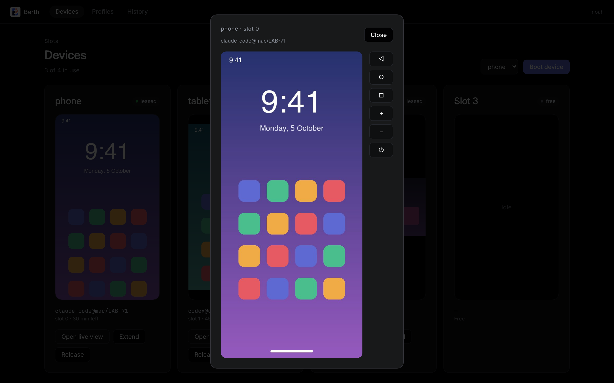
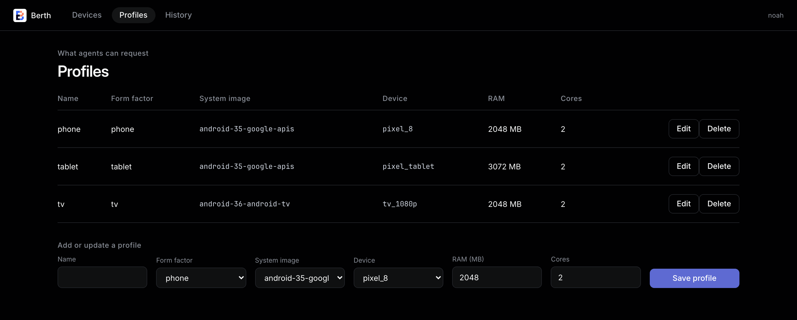
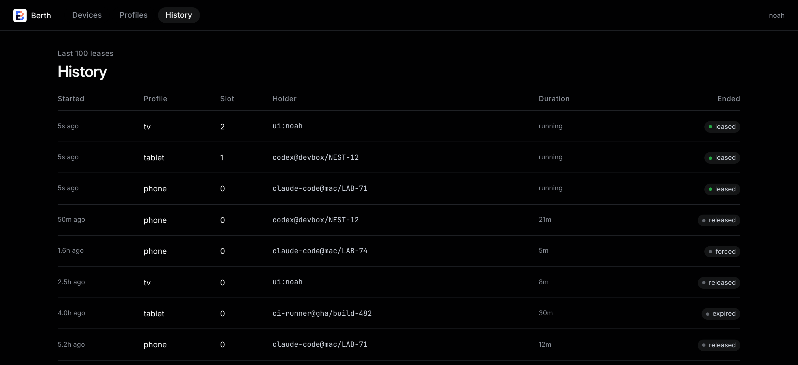

<div align="center">

# Berth



**A lease-based pool of self-hosted Android emulators for agents and humans.**

Check out a phone, tablet, or TV over MCP or HTTP, use it exclusively for a bounded lease, then release it back to the pool.

</div>

## Demo

<p align="center">
  
</p>

## Install

Berth runs on Kubernetes: the hub server starts one emulator Pod per lease.

```bash
docker pull ghcr.io/noahchalifour/emulator-hub:v0.1.1
```

Deployment manifests live in [`home-lab-infrastructure`](https://github.com/noahchalifour/home-lab-infrastructure/tree/main/kubernetes/apps/emulator-hub). Set `HUB_API_TOKEN`, `HUB_EMULATOR_IMAGE`, and `HUB_SLOT_IPS` on the hub.

## Quickstart

Point an MCP client at the machine port (`8081`) and let the agent lease a device:

```bash
claude mcp add --transport http berth http://localhost:8081/mcp \
  --header "Authorization: Bearer $HUB_API_TOKEN"
```

Ask the agent to call `acquire` with a profile such as `phone`. The grant returns the lease id, the `adb` address to `adb connect` to, and `expires_at`. Call `release` when you finish, or let the lease expire.

## Leases over MCP or HTTP

- **MCP tools:** `list_profiles`, `acquire`, `heartbeat`, `release`, and `status` over streamable HTTP at `/mcp`.
- **Bounded leases:** Each lease has a TTL, extends with `heartbeat`, and hits a hard stop after four hours.
- **REST API:** Manage leases and profiles at `/api/leases` and `/api/profiles`.
- **Metrics:** Scrape Prometheus metrics at `/metrics` and probe `/healthz`.

## Live view and takeover

Watch any active session in the browser and take over with touch, keyboard, and the Back, Home, Recents, volume, and power buttons.

<p align="center">
  
</p>

## Profiles and history

- **Form factors:** Phone, tablet, and Android TV profiles ship by default.
- **Editable profiles:** Choose the system image, device, RAM (1024 to 4096 MB), and cores (1 to 4) per profile.
- **Lease history:** Review the last 100 leases with holder, duration, and how each ended.

<p align="center">
  
  
</p>

## Android TV adb key

`android-tv` images only trust the key the emulator pushes at boot. Give the hub one key pair for every emulator:

```bash
adb keygen adbkey
kubectl -n emulator-hub create secret generic emulator-hub-adb-key \
  --from-file=adbkey --from-file=adbkey.pub
```

Mount the Secret into the hub and set `HUB_ADB_KEY_DIR` to the mount path. Agents fetch the key from `GET /adbkey` on the machine port. Anyone with the API token can then reach any leased device over adb.

## License

[MIT](LICENSE). See [CONTRIBUTING.md](CONTRIBUTING.md) to develop or run the tests.
