# Berth logo options

Ten independent concepts generated through Higgsfield Recraft V4.1 in vector mode.
**Selected: option 04, Modular geometric.** Its symbol is used in the app header and favicon; its full logo is used in the project README. SVG originals and 2048px WebP previews are saved alongside this file.

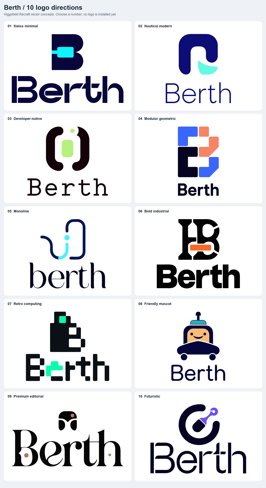

## 01. Swiss minimal

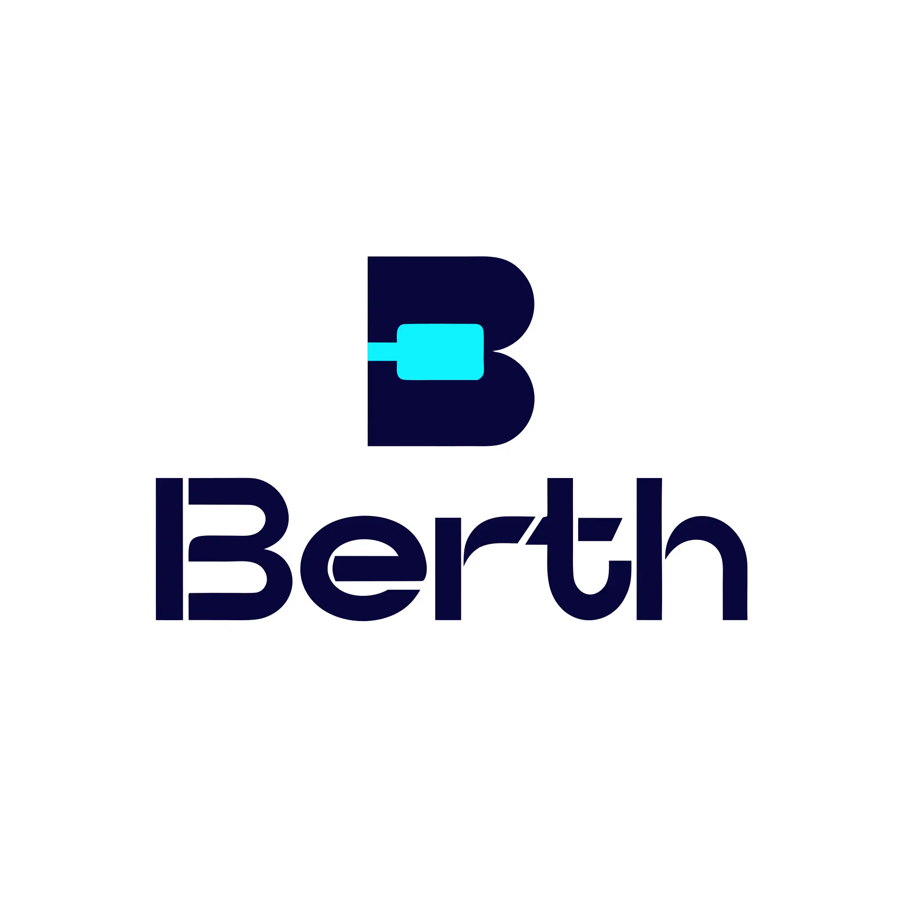

[SVG original](01-swiss-minimal-2.svg) | [Full-size preview](01-swiss-minimal.webp) | [Generated media](https://d8j0ntlcm91z4.cloudfront.net/user_3HTBh2IWiT7s1sOevenju3ejpEc/hf_20261005_200805_86ead5bd-d0d4-4285-9f76-0028ca1b7c16_min.webp)

## 02. Nautical modern

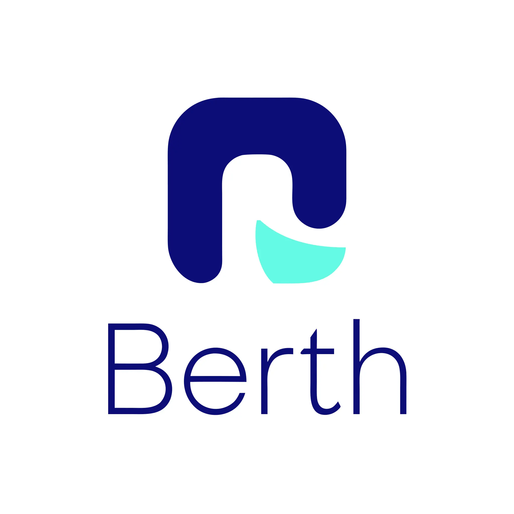

[SVG original](02-nautical-modern-2.svg) | [Full-size preview](02-nautical-modern.webp) | [Generated media](https://d8j0ntlcm91z4.cloudfront.net/user_3HTBh2IWiT7s1sOevenju3ejpEc/hf_20261005_200805_557b23f8-7616-4722-8239-20595104beee_min.webp)

## 03. Developer-native

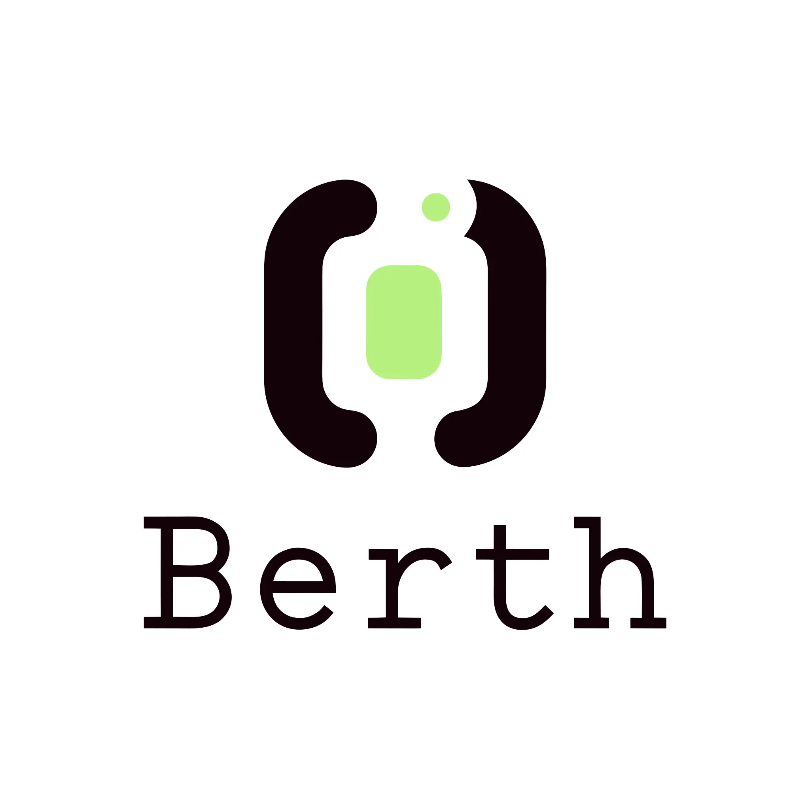

[SVG original](03-developer-native-2.svg) | [Full-size preview](03-developer-native.webp) | [Generated media](https://d8j0ntlcm91z4.cloudfront.net/user_3HTBh2IWiT7s1sOevenju3ejpEc/hf_20261005_200804_5e952aea-ff1c-4394-bee9-e8b5c3ce1553_min.webp)

## 04. Modular geometric

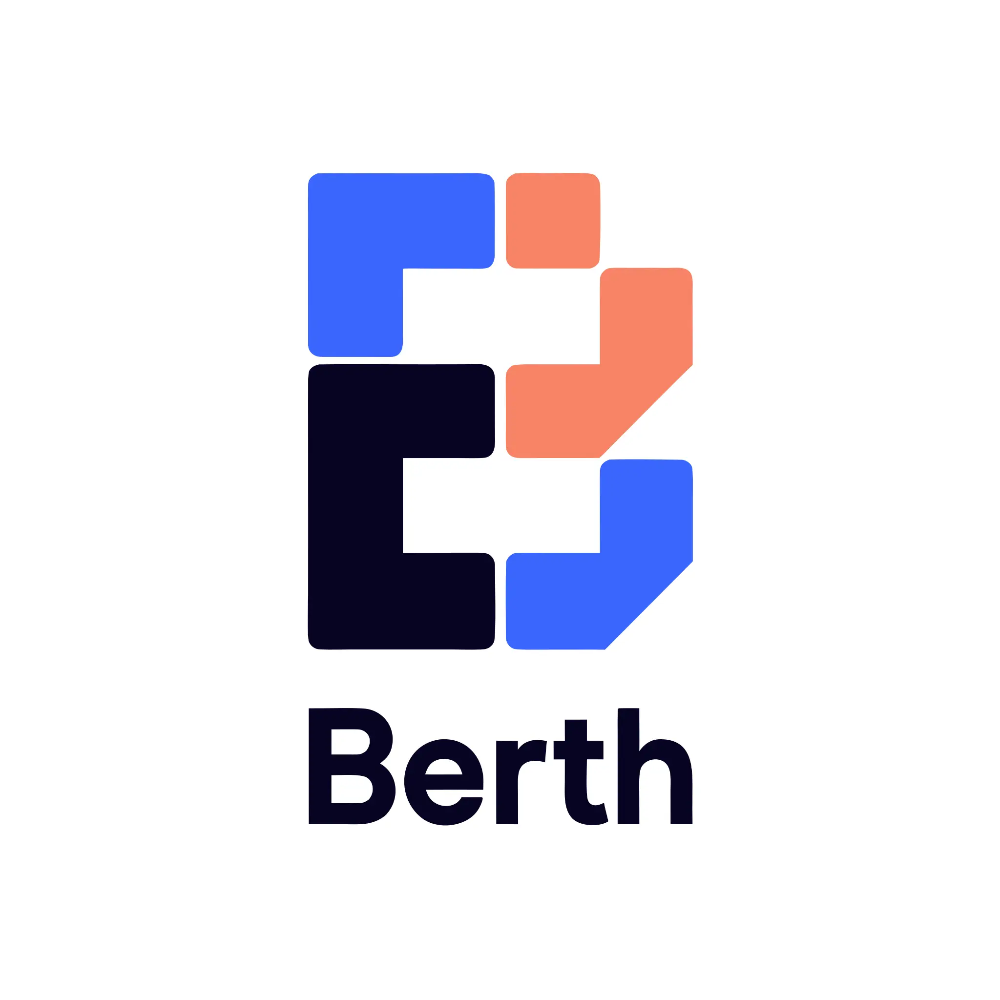

[SVG original](04-modular-geometric-2.svg) | [Full-size preview](04-modular-geometric.webp) | [Generated media](https://d8j0ntlcm91z4.cloudfront.net/user_3HTBh2IWiT7s1sOevenju3ejpEc/hf_20261005_200825_92205d58-9707-4ba9-95ea-bbd3c5983460_min.webp)

## 05. Monoline

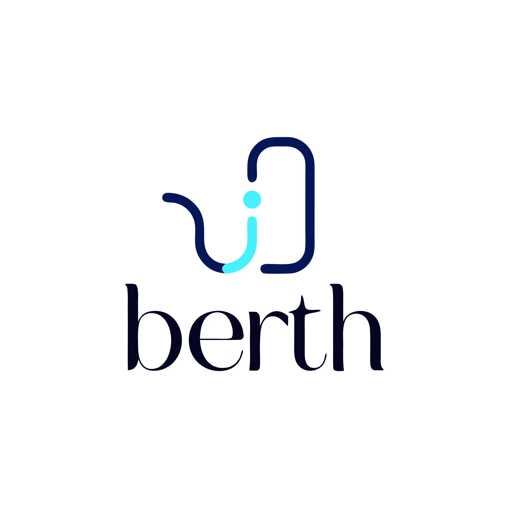

[SVG original](05-monoline-2.svg) | [Full-size preview](05-monoline.webp) | [Generated media](https://d8j0ntlcm91z4.cloudfront.net/user_3HTBh2IWiT7s1sOevenju3ejpEc/hf_20261005_200825_6b555d79-a99e-432a-9a55-67bee08e0276_min.webp)

## 06. Bold industrial

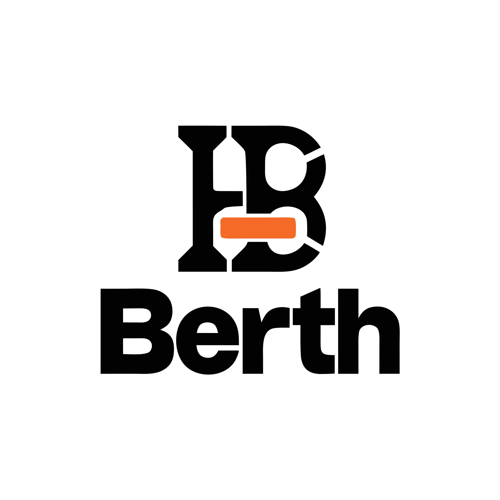

[SVG original](06-bold-industrial-2.svg) | [Full-size preview](06-bold-industrial.webp) | [Generated media](https://d8j0ntlcm91z4.cloudfront.net/user_3HTBh2IWiT7s1sOevenju3ejpEc/hf_20261005_200828_2ad98eb1-ba31-457a-a28d-f82cd9300e81_min.webp)

## 07. Retro computing

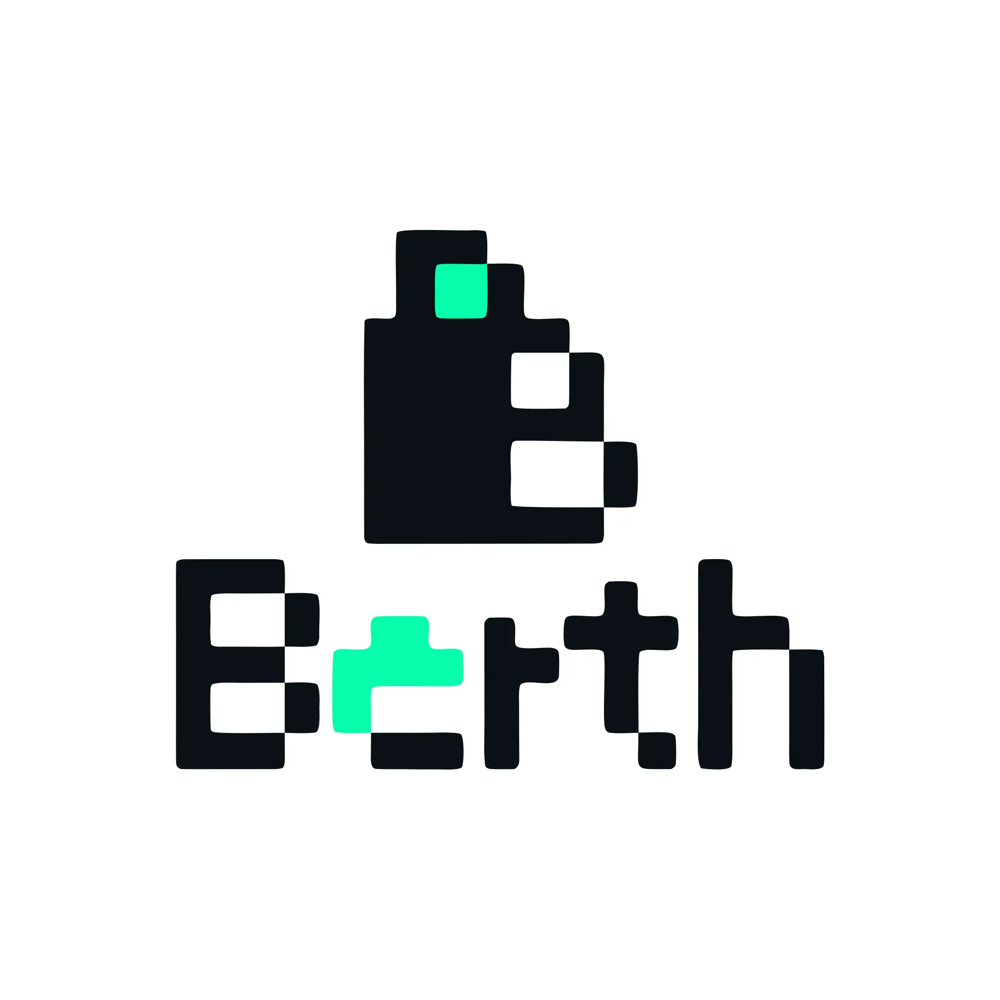

[SVG original](07-retro-computing-2.svg) | [Full-size preview](07-retro-computing.webp) | [Generated media](https://d8j0ntlcm91z4.cloudfront.net/user_3HTBh2IWiT7s1sOevenju3ejpEc/hf_20261005_200845_aebd5b2f-4e2c-4357-a590-de27b3f2ab87_min.webp)

## 08. Friendly mascot

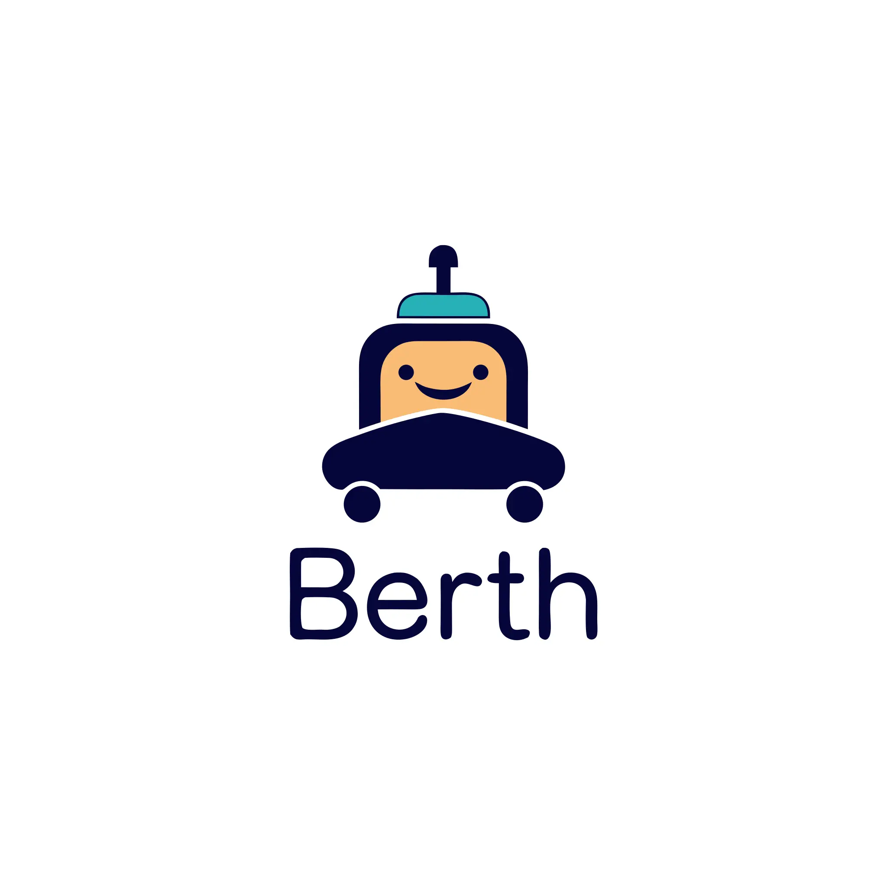

[SVG original](08-friendly-mascot-2.svg) | [Full-size preview](08-friendly-mascot.webp) | [Generated media](https://d8j0ntlcm91z4.cloudfront.net/user_3HTBh2IWiT7s1sOevenju3ejpEc/hf_20261005_200845_7cca1f2d-ae3c-4ef3-8b72-8dc200a68c87_min.webp)

## 09. Premium editorial

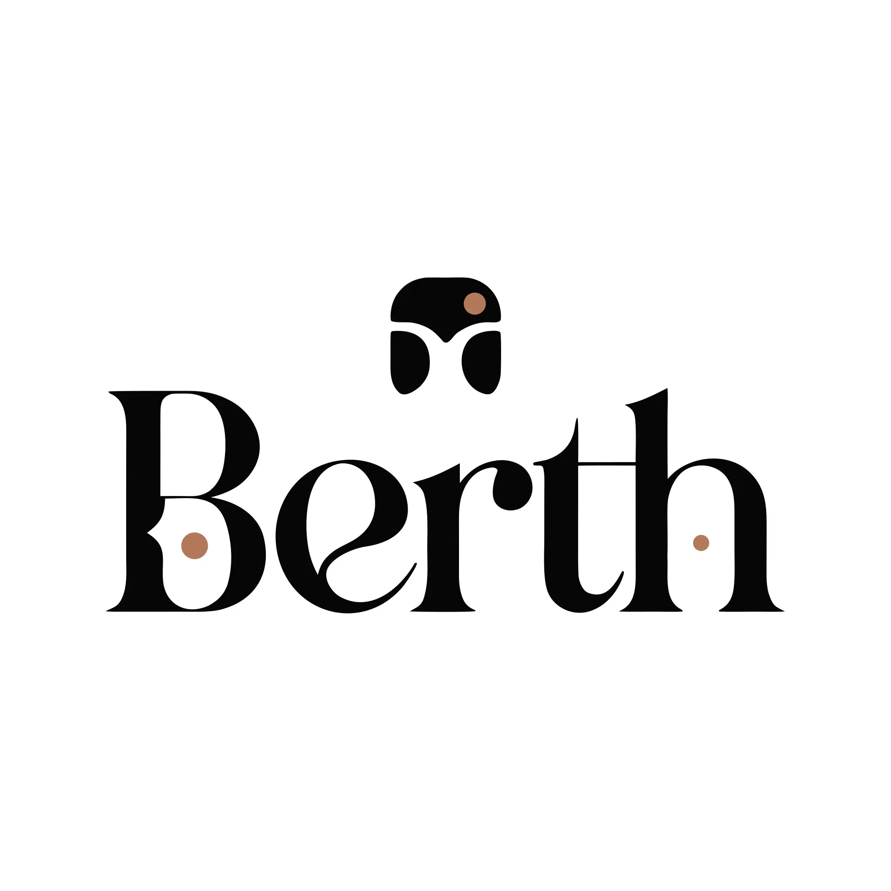

[SVG original](09-premium-editorial-2.svg) | [Full-size preview](09-premium-editorial.webp) | [Generated media](https://d8j0ntlcm91z4.cloudfront.net/user_3HTBh2IWiT7s1sOevenju3ejpEc/hf_20261005_200846_8a4d3cf2-907a-4e6d-98f6-4eedbec8e186_min.webp)

## 10. Futuristic

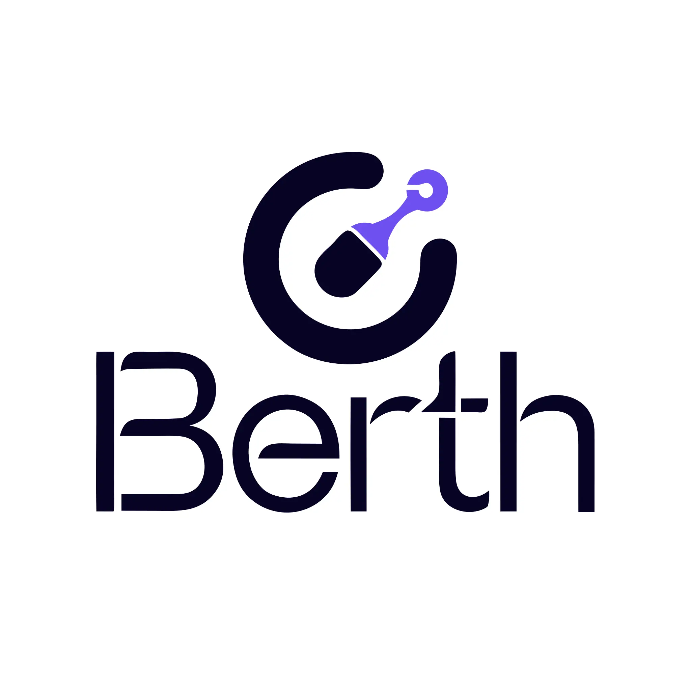

[SVG original](10-futuristic-2.svg) | [Full-size preview](10-futuristic.webp) | [Generated media](https://d8j0ntlcm91z4.cloudfront.net/user_3HTBh2IWiT7s1sOevenju3ejpEc/hf_20261005_200903_b10d3a4b-0fcc-471b-aa8a-589a4c132fde_min.webp)
